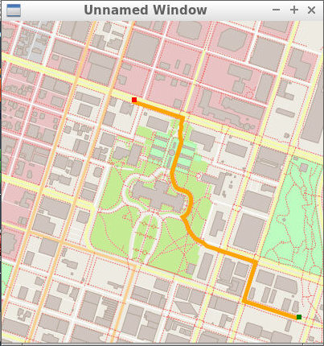
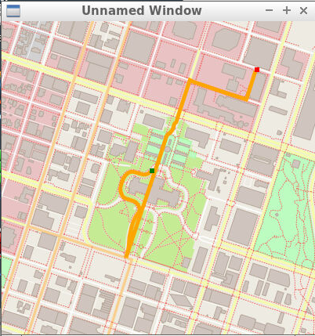
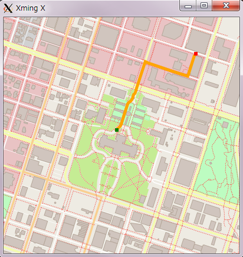

# OSM Route Plannning Project

## Overview

[OpenStreetMap(OSM)](https://en.wikipedia.org/wiki/OpenStreetMap) is an open source project to create free, user generated maps of every part of the world. These maps are similar to the maps we might use in the Google Maps or Apple Maps app on our phone. In this project, I wrote a code in **C++** using OpenStreetMap data and **A\* search** algorithm to find the shortest path between two points.



## Directories in this repository
- `cmake/`: contains `*.cmake` files that find necessary libraries for this project.
- `instructions/`: contains instructions for the exercises.
- `maps/`: OpenStreetMap files. They were taken from the [official site of OpenStreetMap](https://openstreetmap.orgwritten), written in OSM XML file format.
- `src/`: contains source code for this project (see the next section).
- `test/`: contains unit tests for various exercises.
- `thirdparty/`: contains thirdparty libraries that have been included with this project.


## Source code
All source files are in the `src/` directory.
 - `main.cpp`: This controls the flow of the program. It reads OSM data, stores that in `RouteModel` object, then `RoutePlanner` object is created which carris out A\* search, finds the shortest path, and stores the path in `RouteModel` object. Finally the path is rendered using the IO2D library.

 - `model.h` `model.cpp`: These files come from the [IO2D example code](https://github.com/cpp-io2d/P0267_RefImpl/tree/master/P0267_RefImpl/Samples/maps). They are used to define the data structures and methods that read in and store OSM data. OSM data is stored in a `Model` class which contains nested structs for Nodes, Ways, Roads, and other OSM objects.

 - `render.h` `render.cpp`: These files also come from the [IO2D example code](https://github.com/cpp-io2d/P0267_RefImpl/tree/master/P0267_RefImpl/Samples/maps). These files take model data and render it on a map. They had been modified to include three extra methods which render the start point, end point, and path from the A* search, and were provided as a starter code for this project.

 - `route_model.h` `route_model.cpp`: These files contain the definition and implementation of `RouteModel` class. This class inherits the `Model` and `Node` class that came from IO2D example code and is extended on those data structures. I implemented this class to perform A\* search.

 - `route_planner.h` `route_planner.cpp`: These files contain the definition and implementation of `RoutePlanner` class. This class accepts a `RouteModel` along with start and end coordinates, and controls A\* search using those data. I implemented this class to perform A\* search.

## Improvement
After the first commit, I found a problem that this program didn't show the shortest route in some cases.



In the case above, the coordinates are `start = (50, 50)`, `end = (80, 80)`, and the distance of the path is **743.463**.


I by chance reached this [GitHub](https://github.com/dbecad/CppND-Route-Planning-Project) and got inspired by the idea that the neighbor nodes should be obtained based on the sequence(whether the neighbor node is literary next to the current node) rather than the distance. I learned about OSM data deeper and found that a road is made by the sequence of nodes, so I thought that would be right.

After examining the algorithm, I noticed one more thing. The candidate for the neighbor in a certain road could be two, not only one. This is because, in some cases (especially at the start point), we could have a choice to go from both sides. We must examine all the candidates according to the f-value, and choose the next node to go. I changed the algorithm so that two nodes in the same road can be added in the ***open list*** in A\* search.



In the improved version, distance is **353.011** with the same start and end coordinates as the previous image. It seems it's showing the appropriate path.

## Make

To make the executable, execute the commands below in the terminal. In this example, you are in the root of this repository.
```
 > mkdir build
 > cd build
 > cmake ..
 > make
```

To execute the program, input the command shown below:
(the example below is in the case that you are in `build` directory you made in above procedure)
```
 > ../bin/OSM_Route_Planner -f ../maps/map.osm
```
You can specify `*.osm` files as input OSM file.

Then you are asked to input start and end coordinates on the terminal.
```
Enter coordinates of the start and the goal below (0 to 100).
Press RETURN after input each value.
Starting point x ->
```
After you input the coordinates properly, the map with the shortest path is shown.

## Testing

For exercises that have unit tests, the project must be built with the approprate test cpp file. This can be done by using `cmake_tests` instead of `cmake`. For example, from the build directory:
```
cmake_tests ..
make
```
Those commands will build the code with the appropriate tests exercise. The tests can then be run from the `build` directory as follows:
```
../bin/test
```
Not all exercises have tests. The table is given below with the complete list of exercises with tests for reference:

| Exercise Name               |
|-----------------------------|
| The RouteModel Class        |
| The Node Class              |
| Create RouteModel Nodes     |
| Write the Distance Function |
| Create Road to Node Hashmap |
| Write FindNeighbors         |
| Find the Closest Node       |
| Write the A* Search Stub    |
| Finish A* Search            |

## Note

This project is a part of [Udacity C++ Nanodegree program](https://www.udacity.com/course/c-plus-plus-nanodegree--nd213).
